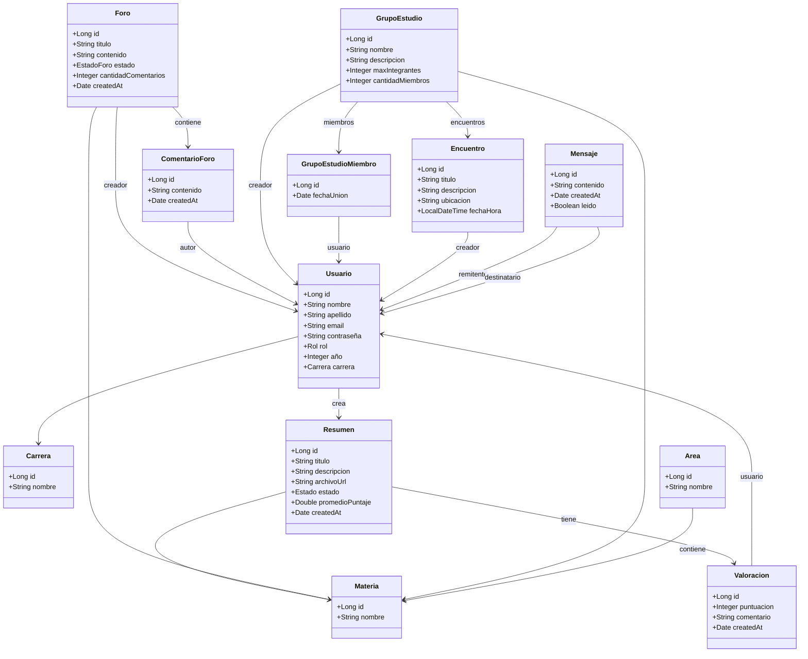
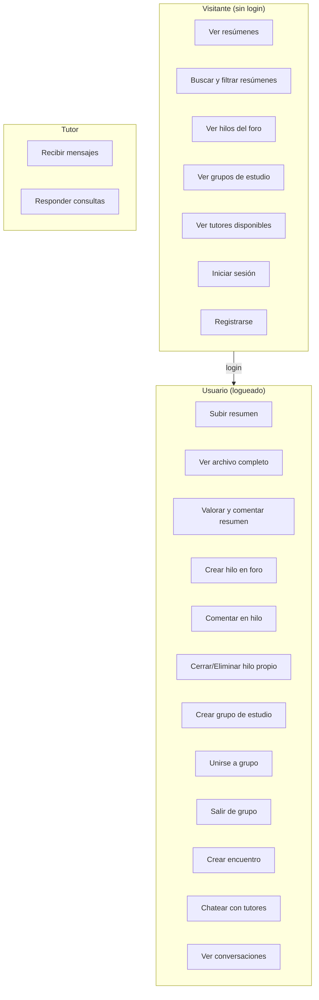
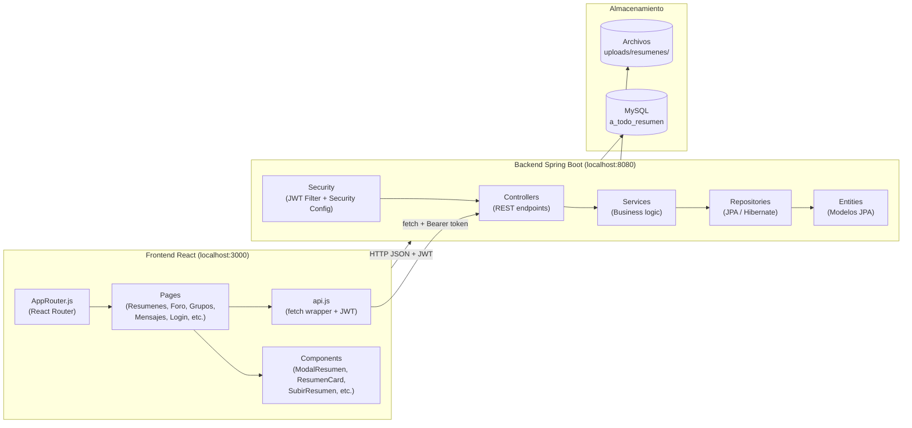
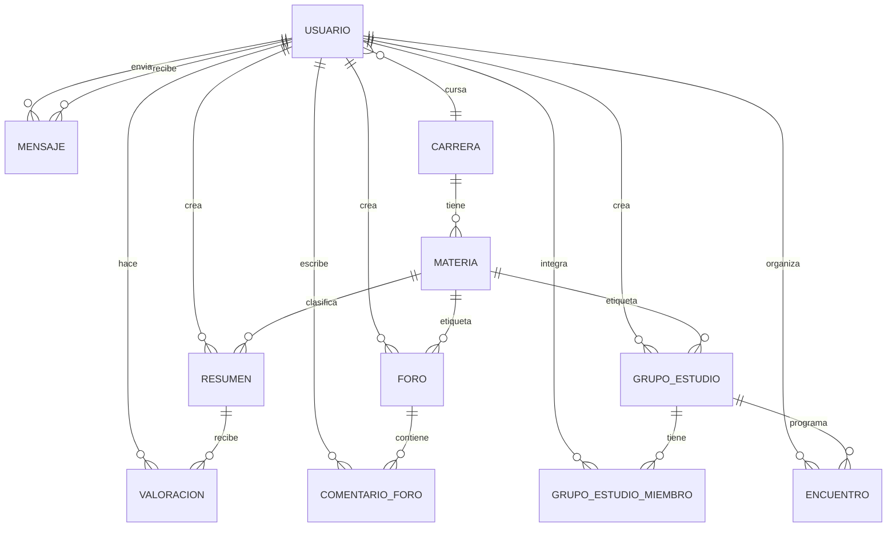

# Diagramas del Proyecto — A Todo Resumen

---

## 1. Diagrama de Clases (Backend)

---

## 2. Diagrama de Casos de Uso

---

## 3. Diagrama de Arquitectura (Componentes)

---

## 4. Diagrama de Base de Datos (DER)

